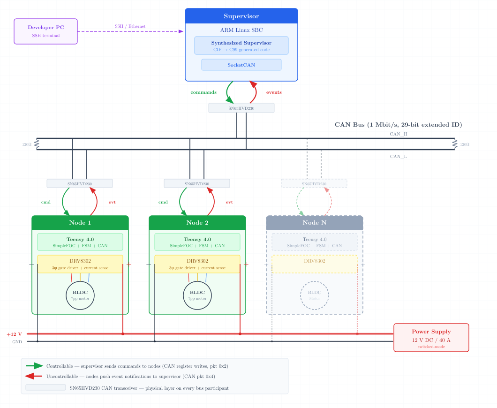
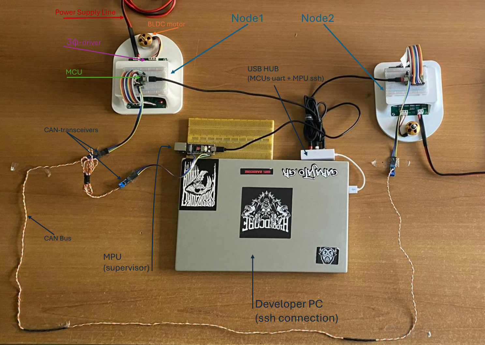
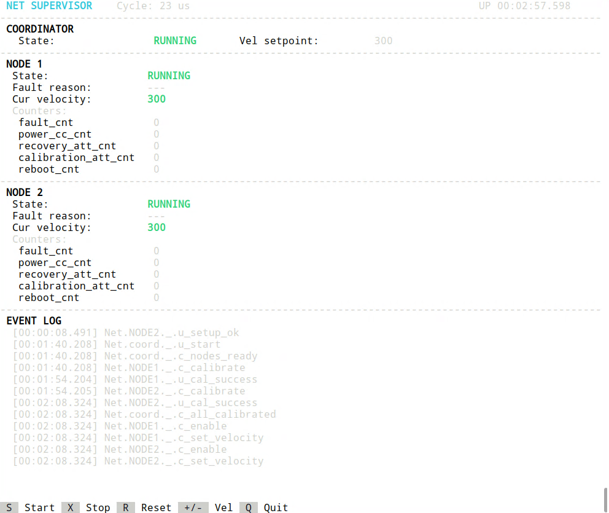

<p align="center">
  
</p>

# Model Based Synthesis and Validation of High Performance Supervisory Controllers for Embedded Systems

**Integrated Master's Thesis (B.Sc. & M.Sc.)** — Stavros Martini

Hellenic Mediterranean University, Department of Electrical and Computer Engineering
Division of Electronics, Systems and Computer Technology

Supervisor: Prof. George Kornaros | May 2026

---

## Overview

This repository contains the complete implementation of a two-layer embedded control architecture for distributed BLDC motor networks. The upper layer is a formally synthesized supervisory controller generated from CIF plant and requirement specifications using the [Eclipse ESCET](https://eclipse.dev/escet/) toolkit. The lower layer provides real-time field-oriented control (FOC) of brushless DC motors using the [SimpleFOC](https://simplefoc.com/) library. The two layers communicate over CAN 2.0B.

The architecture is validated on a physical two-node motor network implementing a Heat Recovery Ventilation (HRV) system with 46 formal requirements covering coordinated startup, sequential calibration, fault recovery with bounded retries, and balanced fan operation.

---

## Hardware Specification

### Supervisor Node

| Parameter | Value |
|---|---|
| Board | [Luckfox Lyra Plus](https://www.luckfox.com/Luckfox-Lyra/EN-Luckfox-Lyra-Plus) |
| SoC | [Rockchip RK3506G2](https://opensource.rock-chips.com/images/5/51/Rockchip_RK3506G2_Datasheet_V1.3-20250811.pdf) |
| CPU | Triple-core ARM Cortex-A7 at 1.2 GHz |
| Memory | 128 MB DDR3L |
| OS | Linux (Buildroot) |
| CAN transceiver | [SN65HVD230](https://www.ti.com/product/SN65HVD230) (3.3 V, up to 1 Mbit/s) |
| Network interface | 10/100 Mbps Ethernet (SSH access) |

### Motor Drive Nodes (x2)

| Parameter | Value |
|---|---|
| MCU | [Teensy 4.0](https://www.pjrc.com/store/teensy40.html) (NXP i.MX RT1062, ARM Cortex-M7, 600 MHz) |
| Gate driver board | [DRV8302 3-phase driver board](https://docs.simplefoc.com/drv8302_example) (commercially procured) |
| Gate driver IC | [Texas Instruments DRV8302](https://www.ti.com/product/DRV8302) (SLVSA73C) |
| Power MOSFETs | 6x NCE80H11D (V_DS = 80 V, R_DS(on) = 11 mOhm) |
| Current sensing | 3x external differential amplifiers, gain 12.22 V/V |
| Buck converter | DRV8302 integrated, 3.3 V regulated output |
| CAN transceiver | [SN65HVD230](https://www.ti.com/product/SN65HVD230) (3.3 V, up to 1 Mbit/s) |
| Supply voltage range | 6-45 V DC |
| Continuous phase current | 15 A (27 A peak, no forced cooling) |

### Motor

| Parameter | Value |
|---|---|
| Type | Brushless DC (BLDC), outrunner |
| KV rating | 1000 KV (RPM/V) |
| Pole pairs | 7 |
| Phase resistance | Measured at runtime via `motor.characteriseMotor()` |
| Phase inductance | Measured at runtime via `motor.characteriseMotor()` |

### Communication Bus

| Parameter | Value |
|---|---|
| Standard | CAN 2.0B (extended 29-bit identifiers) |
| Bitrate | 1 Mbit/s |
| Termination | 120 Ohm at each end |
| Transceiver (all nodes) | [Texas Instruments SN65HVD230](https://www.ti.com/product/SN65HVD230) |
| Protocol | [CANCommander](https://docs.simplefoc.com/cancommander) register-based (SimpleFOC community) |

### Power Supply

| Parameter | Value |
|---|---|
| Type | Switched-mode DC power supply |
| Output | 12 V DC |
| Current rating | 40 A |
| Distribution | Shared rail to all motor drive nodes |

### DRV8302 Pin Configuration

| Pin | State | Effect |
|---|---|---|
| M_PWM | HIGH | 3-PWM mode, hardware dead-time insertion |
| M_OC | LOW | Cycle-by-cycle current limiting (non-latching) |
| GAIN | LOW | Internal current sense gain 10 V/V |
| OC_ADJ | HIGH | Over-current comparator disabled; nOCTW thermally exclusive |
| DC_CAL | LOW | Normal current sense operation |

### DRV8302 Diagnostic Outputs

| Signal | Type | Function |
|---|---|---|
| nFAULT | Open-drain, active LOW | Gate shutdown on PVDD_UV, GVDD_UV, GVDD_OV, or OTSD |
| nOCTW | Open-drain, active LOW | Over-temperature warning at 130 C (clears at 115 C) |
| PWRGD | Open-drain, active LOW | Buck output outside 92-109% of nominal |

### Fault Classification (after 50 ms debounce)

| PWRGD | nFAULT | nOCTW | Fault class |
|---|---|---|---|
| LOW | x | x | Supply failure |
| HIGH | LOW | LOW | Thermal shutdown (OTSD, 150 C) |
| HIGH | LOW | HIGH | GVDD overvoltage |

---

## Software Architecture

### Control Layers

| Layer | Implementation | Cycle rate | Responsibility |
|---|---|---|---|
| Supervisor | Generated C99 from [CIF/ESCET](https://eclipse.dev/escet/) | 100 Hz (10 ms) | System-wide coordination, safety logic, fault recovery |
| Resource control (FOC) | [SimpleFOC](https://simplefoc.com/) library | ~20 kHz | Phase current regulation, PWM generation, motor commutation |
| Local safety | Node firmware state machine | ~150 kHz | Immediate fault reaction, gate driver management |

### SimpleFOC Configuration

| Parameter | Setting |
|---|---|
| Motion control | `velocity_openloop` |
| Torque control | `TorqueControlType::voltage` (Level 2: R + KV compensation) |
| FOC modulation | `SpaceVectorPWM` |
| PWM frequency | 20 kHz |
| Position sensor | None (open-loop, synthetic angle integration) |
| Current sensor | 3-phase external amplifier chain (available, not closed-loop) |

### Node State Machine

Ten states with a static whitelist transition table:

`INIT`, `SETUP_ERROR`, `NEEDS_RECAL`, `CALIBRATING`, `CAL_FAILED`, `IDLE`, `RUNNING`, `STOPPING`, `FAULT`, `NO_POWER`

Safety-critical transitions (fault detection to motor disable) are handled locally before any CAN notification is sent. The node never waits for supervisor approval to enter a safe state.

### CAN Identifier Layout (29-bit extended)

| Bits | Field | Range |
|---|---|---|
| 27-20 | Node address | 0x00-0xFF (0xFF = broadcast) |
| 19-16 | Packet type | 0x1 read, 0x2 write, 0x3 response, 0x4 event push |
| 15-8 | Register / event number | 0x00-0xFF |
| 7-0 | Motor index | 0x00-0xFF |

### Controllable Events (Supervisor to Node — CAN register writes)

| Register | Name | CIF event | Action |
|---|---|---|---|
| 0xF0 | State | — | Returns current node state (read-only) |
| 0xF1 | Calibrate | `c_calibrate` | Trigger `characteriseMotor()` for R and L measurement |
| 0xF2 | Enable | `c_enable` | Transition to RUNNING, enable motor and gate driver |
| 0xF3 | Stop | `c_stop` | Transition to STOPPING, begin controlled deceleration |
| 0xF4 | Recover | `c_recover` | Attempt EN_GATE reset sequence on DRV8302 |
| 0xF5 | Cal. reject | `c_cal_reject` | Reject failed calibration, return to NEEDS_RECAL |
| 0xF6 | Velocity | `c_set_velocity` | Write target velocity (4-byte IEEE 754 float, rad/s) |
| 0xF8 | Reboot | `c_reboot` | ARM system reset (SCB_AIRCR) |

### Uncontrollable Events (Node to Supervisor — CAN event push, packet type 0x4)

| Event code | Name | CIF event | Trigger condition |
|---|---|---|---|
| 0x01 | Setup OK | `u_setup_ok` | Hardware initialization completed successfully |
| 0x02 | Setup error | `u_setup_error` | Driver, motor, or current sense init failed |
| 0x03 | Cal. success | `u_cal_success` | `characteriseMotor()` returned valid R and L |
| 0x04 | Cal. failed | `u_cal_failed` | `characteriseMotor()` returned invalid parameters |
| 0x05 | Fault | `u_fault` | nFAULT asserted, nOCTW high (electrical fault) |
| 0x06 | No power | `u_no_power` | PWRGD asserted low (supply failure) |
| 0x07 | Power restore | `u_power_restore` | PWRGD returned high after supply failure |
| 0x08 | Stopped | `u_stopped` | Motor velocity reached zero during controlled stop |
| 0x09 | Overheated | `u_overheated` | nFAULT asserted, nOCTW low (thermal shutdown) |
| 0x0A | Cooled | `u_cooled` | nOCTW returned high after thermal event, EN_GATE reset succeeded |
| 0x0B | Fault cleared | `u_fault_cleared` | EN_GATE reset succeeded after electrical fault |
| 0x0C | Recover failed | `u_recover_failed` | EN_GATE reset attempted, nFAULT remains asserted |

---

## Repository Structure

```
.
├── main.c                        Supervisor application entry point
├── can_if.c / can_if.h           CAN interface library (Linux SocketCAN)
├── net_tui.c / net_tui.h         Terminal user interface
├── BUILD.sh                      Cross-compile, link, and deploy to target
├── send_simple_test.sh            Deploy standalone test to target
├── simple_test.c                 Standalone test harness
│
├── Arduino/
│   ├── TEMPO.ino                 Motor drive node firmware (Teensy 4.0)
│   └── can_node.h                CAN event and register definitions
│
├── CIF/
│   ├── Models/
│   │   ├── NODE.cif              Node plant model (DRV8302 motor node EFA)
│   │   ├── Coordinator.cif       System coordinator plant model
│   │   ├── NET.cif               Network instantiation (coordinator + 2 nodes)
│   │   ├── Requirements.cif      46 formal requirements
│   │   └── node.graphml          State machine visualization (yEd)
│   ├── Synth/
│   │   └── output_NET.cif        Synthesized supervisor
│   ├── gen/
│   │   ├── NET_engine.c          Generated supervisor engine (49 edge functions)
│   │   ├── NET_engine.h
│   │   ├── NET_library.c         Generated CIF runtime library
│   │   ├── NET_library.h
│   │   ├── NET_test_code.c       Generated test skeleton
│   │   ├── NET_compile.sh        Generated build script
│   │   └── NET_readme.txt        Generated documentation
│   ├── synthesize.tooldef        Synthesis script
│   ├── properties.tooldef        Controller properties check script
│   ├── simulate.tooldef          Interactive simulation script
│   └── generate_code.tooldef     Code generation script
│
├── bin/                          Compiled objects and ARM binary
│   └── NET_engine_arm            Deployment binary
│
├── Thesis/
│   ├── main.typ                  Thesis source (Typst)
│   ├── references.bib            Bibliography
│   └── img/                      Figures and diagrams
│
├── Thesis.pdf                    Compiled thesis document
├── Thesis.zip                    Thesis source archive
└── README.md
```

---

## Dependencies

**Supervisor (Linux, ARM)**
- GCC with C99 support (`arm-linux-gnueabihf-gcc` for cross-compilation)
- Linux kernel with SocketCAN support

**Node firmware**
- Arduino or PlatformIO toolchain for [Teensy 4.0](https://www.pjrc.com/store/teensy40.html)
- [SimpleFOC](https://github.com/simplefoc/Arduino-FOC) library (v2.x)
- [FlexCAN_T4](https://github.com/tonton81/FlexCAN_T4) library

**Modeling and synthesis**
- [Eclipse ESCET](https://eclipse.dev/escet/) toolkit (v4.0 or later)
- CIF toolset for synthesis, simulation, controller properties checking, and C99 code generation

**Thesis document**
- [Typst](https://typst.app/) (source included in `Thesis/` and `Thesis.zip`)

---

## Building

### Supervisor

`BUILD.sh` cross-compiles the generated engine together with the integration code and deploys the binary to the Luckfox board over SCP:

```
./BUILD.sh
```

This produces `bin/NET_engine_arm` and transfers it to the target. Connect via SSH and run the binary.

### Node Firmware

Open `Arduino/TEMPO.ino` in PlatformIO or the Arduino IDE configured for Teensy 4.0. Install the [SimpleFOC](https://github.com/simplefoc/Arduino-FOC) and [FlexCAN_T4](https://github.com/tonton81/FlexCAN_T4) libraries. Upload to each node.

### Synthesis (reproducing the supervisor from models)

From the ESCET IDE, run the tooldef scripts in order:

1. `CIF/synthesize.tooldef` — synthesizes the supervisor from plant and requirement models
2. `CIF/properties.tooldef` — verifies bounded response, confluence, and non-blocking
3. `CIF/generate_code.tooldef` — generates C99 code into `CIF/gen/`

---

## Verification Results

| Property | Result |
|---|---|
| Bounded response (uncontrollable loop) | At most 2 iterations |
| Bounded response (controllable loop) | At most 2 iterations |
| Confluence | Verified |
| Non-blocking under control | Verified |

---

## Performance Summary

| Metric | Value |
|---|---|
| CIF model size (plants + requirements) | 844 lines |
| Formal requirements | 46 |
| Synthesis time | ~2.5 s |
| Generated C99 code (engine + library) | 2,392 lines |
| Hand-written integration code (CAN, TUI, main) | 814 lines |
| Generated edge functions | 49 |
| Supervisor application cycle | 10 ms (100 Hz) |
| Measured engine execution time | < 150 us |
| Runtime memory footprint (text + data + BSS) | ~43 KB |

---

## Test Results

The following fault scenarios were validated on live hardware with motors running:

- Electrical fault injection (nFAULT grounded) on each node independently
- Thermal fault injection (nFAULT + nOCTW grounded) on each node independently
- Power supply loss (PWRGD grounded) on each node independently
- Counter exhaustion for all five counter types (fault, power, recovery, calibration, reboot)
- Normal startup, coordinated operation, and coordinated shutdown
- Sequential calibration enforcement (NODE1 before NODE2)
- Balanced operation enforcement (both fans or neither)

In all cases the supervisor behaved as the formal model predicted. No deadlocks, no requirement violations, and no unexpected state transitions were observed.

**Supervisor TUI during coordinated operation:**
<p align="center">
   
</p>
     
<p align="center">
  
</p>
The display shows coordinator phase and velocity setpoint, per-node state with color coding (green = healthy, red = fault), diagnostic counters, and the real-time event log.

---

## References

- Ramadge, P.J. and Wonham, W.M. (1987). Supervisory Control of a Class of Discrete Event Processes. SIAM Journal on Control and Optimization, 25(1), 206-230.
- Eclipse Foundation. [Eclipse ESCET — The Eclipse Supervisory Control Engineering Toolkit](https://eclipse.dev/escet/).
- Skuric, A. et al. (2022). [SimpleFOC: A Field Oriented Control (FOC) Library for Controlling BLDC and Stepper Motors](https://doi.org/10.21105/joss.04232). Journal of Open Source Software, 7(74), 4232.
- Texas Instruments. [DRV8302](https://www.ti.com/product/DRV8302) Three Phase Gate Driver With Dual Current Shunt Amplifiers and Buck Regulator. SLVSA73C, Rev. C (2016).
- Texas Instruments. [SN65HVD230](https://www.ti.com/product/SN65HVD230) 3.3-V CAN Bus Transceiver. SLLS559H (2001, revised 2018).
- Rockchip Electronics. [RK3506G2 Datasheet](https://opensource.rock-chips.com/images/5/51/Rockchip_RK3506G2_Datasheet_V1.3-20250811.pdf), Rev. 1.3 (2025).
- IEC 61508:2010. Functional safety of electrical/electronic/programmable electronic safety-related systems.
- ASHRAE Standard 62.2-2019. Ventilation and Acceptable Indoor Air Quality in Low-Rise Residential Buildings.

---

## License

This repository contains the source material for an integrated master's thesis. The CIF models, generated code, and integration code are provided for academic and engineering reference. The [Eclipse ESCET](https://eclipse.dev/escet/) toolkit is available under the Eclipse Public License. [SimpleFOC](https://github.com/simplefoc/Arduino-FOC) is licensed under the MIT License.
